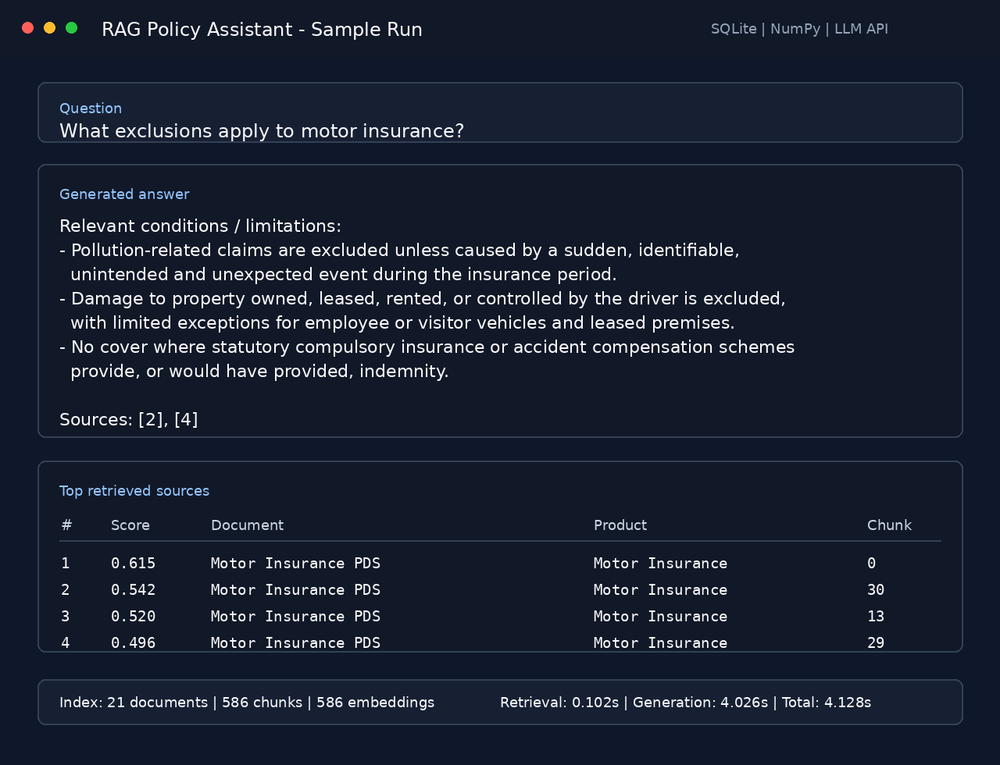

# Policy Document RAG Demo

Learning project for a retrieval-augmented generation pipeline over public insurance policy documents.

The pipeline loads extracted policy text, chunks it with metadata from `manifest.csv`, stores chunks and lightweight local hashing embeddings in SQLite, retrieves relevant passages, and asks DeepSeek to generate a cited answer.

## Sample Output



## Setup

```bash
python3 -m venv .venv
source .venv/bin/activate
pip install -r requirements.txt
cp .env.example .env
```

`DEEPSEEK_API_KEY` should come from the shell environment:

```bash
test -n "$DEEPSEEK_API_KEY"
```

Use `.env` for non-secret config such as model name, database path, and `TOP_K`.
The default DeepSeek model id is `deepseek-v4-pro`.

## Build The Index

```bash
source .venv/bin/activate
python -m scripts.build_index --dry-run
python -m scripts.build_index
python -m scripts.inspect_db
```

## Ask A Question

```bash
python -m scripts.ask --retrieve-only "What exclusions apply to motor insurance?"
python -m scripts.ask --retrieve-only --show-chunks "What exclusions apply to motor insurance?"
python -m scripts.ask "Does the business insurance policy include flood cover?"
```

`--retrieve-only` shows the ranked source table. Add `--show-chunks` only when you want compact retrieved text snippets for debugging.

## Evaluate Retrieval

```bash
python -m scripts.evaluate
```

The evaluation checks whether the expected document appears in the top retrieved sources for the starter question set.

## Data

Documents are stored under the configured data directory. The pipeline reads pre-extracted text files and metadata from `manifest.csv`.

## Limitations

This is not legal, financial, or insurance advice. Public documents may not match a specific customer policy schedule, endorsement, or quote-specific term. Page-level citation is not implemented yet. DeepSeek output is generated text and should not be treated as authoritative policy interpretation.
